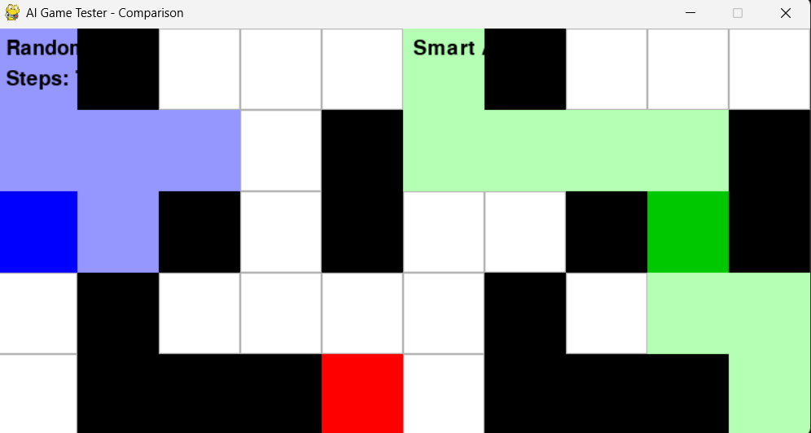
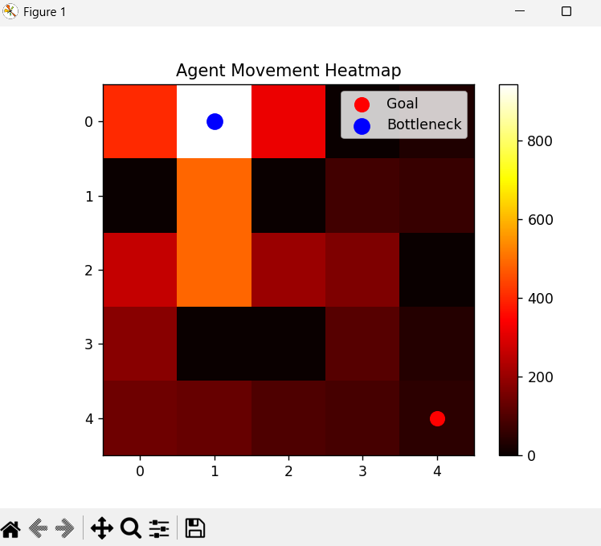

#  AI Game Tester

##  Overview

This project simulates AI agents navigating a grid-based game environment and evaluates their performance using visualization and data analysis.


##  Agents

* Random Agent → moves randomly
* Smart Agent → uses BFS (shortest path)


##  Features

* Real-time simulation using Pygame
* Side-by-side agent comparison
* Path tracking and visualization
* Performance analysis using graphs
* Heatmap of agent movement


##  Results

* Smart agent performs significantly better than random agent
* Higher success rate
* Fewer steps


## Output

###  Game Comparison



###  Performance Graph

.png)

###  Heatmap




##  Tech Stack

* Python
* NumPy
* Matplotlib
* Pygame


##  Run


python main.py
python performance_graph.py
python game_visual.py
```
